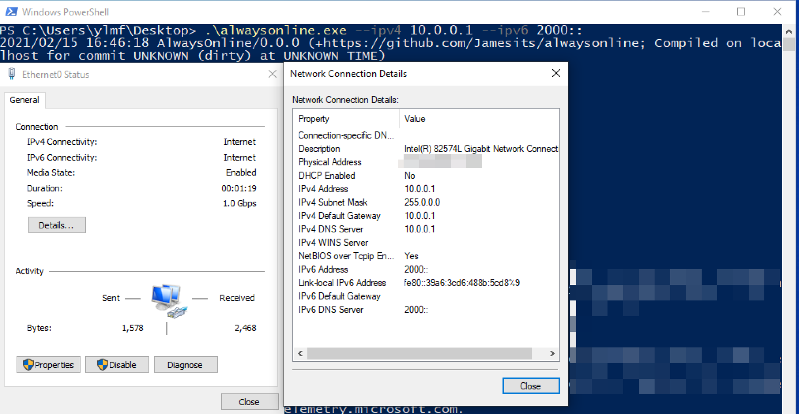

# AlwaysOnline

Bypass NCSI and portal detection on a network level.

[](https://dev.azure.com/nekomimiswitch/General/_build/latest?definitionId=89&branchName=master)

## Usage

Ports required: tcp/80, tcp/53, udp/53.

Start the server:

```shell script
alwaysonline [--ipv4 192.168.1.2] [--ipv6 fd00::2]
```

(The IP addresses are the server IP addresses on the user-facing interface. If the server is behind destination NAT, use the public IP. The server will always listen on all the IPs available; these IP hints are just for faking DNS results.)

Hijack the following domains on your DNS server to the alwaysonline server:

```
// Windows
www.msftncsi.com
www.msftconnecttest.com

// iOS, macOS
captive.apple.com

// Android
connectivitycheck.gstatic.com
connectivitycheck.android.com
connect.rom.miui.com
network-test.debian.org
```

## Technical Details

### Windows 10

Service `NlaSvc` controls NCSI -- Network Connectivity Status Indicator, i.e. the tray icon on your taskbar showing whether you have Internet access. The service, when it goes wrong, is very annoying, as it will cause Microsoft Store to be unusable and all your UWP games unplayable even if you *actually* have Internet access.

NCSI use a set of DNS and HTTP tests to detect if the device is connected to the Internet. The tests can be customized at `HKEY_LOCAL_MACHINE/SYSTEM/CurrentControlSet/Services/NlaSvc/Parameters/Internet`. AlwaysOnline implements the default config.

For a network to trigger the NCSI tests, you need an address, network mask and DNS server to be set. For IPv6 networks, the IP address need to be a global one (in the range `2000::/3`). Sometimes you need a default gateway, but not always. 



NCSI will cache negative results for a network, so if a network is detected to be non-Internet, NCSI will not test it for a long period, even if the network adapter is disabled then re-enabled.
